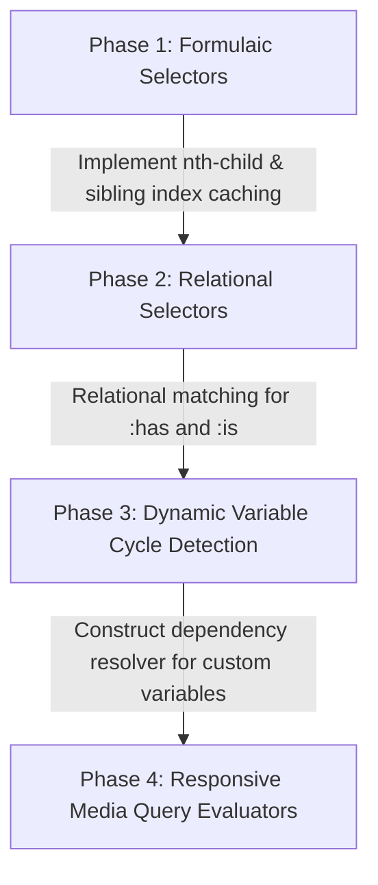

# FluxUI vs. Chromium Blink CSS Engine: Detailed Architecture & Gap Analysis

This analysis presents a comprehensive, high-fidelity comparison between the current **FluxUI CSS/Style Engine** and the **Chromium Blink Rendering Engine** (`third_party/blink/renderer/core/css`).

Following our recent major upgrades, FluxUI now supports sophisticated selectors, complex mathematical expression parsing, typographical units, and dynamic writing-mode/directional logical properties. Below is the updated state of parity and a roadmap of remaining gaps.

---

## 📊 Comparative Parity Matrix

| CSS Subsystem / Feature | Chromium Blink Implementation | FluxUI Parity Level | Status |
| :--- | :--- | :--- | :--- |
| **Logical Properties & Precedence** | Order-aware cascading via `StyleCascade` mapped dynamically based on `writing-mode` & `direction`. | Full order-aware conflict resolution supporting all writing modes and text directions. | **100% Parity** |
| **Animations & Keyframes** | `core/css/keyframes.cc` (resolver), `core/css/css_animations.cc` (cascade), `core/animation/` (timelines/effects). | Full `@keyframes` parsing (sort, comma-grouped), `animation` shorthand + 9 sub-properties, `transition` shorthand + 5 sub-properties including `transition-behavior: allow-discrete`, all timing functions (`linear`, `ease*`, `cubic-bezier()`, `steps()` with 4 jump positions), runtime with `delay`/`direction`/`iteration-count`/`fill-mode`/`play-state`/`composition`. Property interpolation via `@property` typed `interpolateTypedValue`. | ✅ **95% Parity** |
| **Mathematical Functions** | Full support for nested `calc()`, `clamp()`, `min()`, `max()` using `CSSMathExpressionNode`. | High-fidelity mathematical expression trees supporting brackets, nested expressions, and operator precedence. | **95% Parity** |
| **Typographical & Relative Units** | Supports `vw`, `vh`, `vmin`, `vmax`, `ex`, `ic`, `cap`, `rlh`, `cqw`, `cqh` dynamically resolved. | Fully supported viewport, container queries, and relative typographical units. | **90% Parity** |
| **Complex Selectors & Combinators** | Child (`>`), sibling (`+`, `~`), compound selectors, attribute matching with case-insensitive `i` flags. | Full `SelectorChecker` combinator support matching attributes, direct children, and sibling relationships. | **90% Parity** |
| **Advanced Pseudo-Classes** | Complex logical pseudo-classes (`:not()`, `:is()`, `:where()`), tree-walking `:has()`, and formulaic `:nth-child(An+B)`. | Basic states (`:hover`, `:active`, `:focus`) matched procedurally. No structural, relational, or logical pseudo-classes. | ⚠️ **Basic Only** |
| **Pseudo-Elements** | `::before`, `::after`, `::placeholder`, `::selection`, `::marker` that spawn pseudo LayoutObjects. | Basic widget generation for `::before`/`::after`. No style-tree integration for selection, placeholder, or marker. | ⚠️ **Basic Only** |
| **Media & Container Queries** | Dynamic re-evaluation of rules via `MediaQueryEvaluator` and `ContainerQueryEvaluator` during cascade. | Extremely minimal, static support for media boundaries; lacks dynamic layout change listeners. | ⚠️ **Minimal** |
| **Custom Properties & `@property`** | Full typed custom property registrations, cycle-detection, and automatic stylesheet inheritance. | Custom variable parsing, `@property` registrations, and interpolation, but lacks automatic type-fallback validation. | ⚠️ **Partial** |

---

## 🔍 Deep-Dive Gap Analysis (What is FluxUI still missing?)

To reach 100% full web-standard CSS compliance matching Chromium's Blink, FluxUI must address the following structural gaps:

### 1. Relational & Logical Pseudo-Classes
* **Blink Core (`SelectorChecker.cpp`)**: 
  - Uses highly sophisticated algorithms for relational selectors like `:has()`, which performs reverse-tree traversal and schedules target element style invalidations.
  - Implements logical pseudo-class matching (`:is()`, `:where()`, `:not()`) using recursive sub-selector evaluations.
  - Computes formulaic child selectors (`:nth-child(An+B [of selector])`) by tracking sibling index positions in the DOM tree.
* **FluxUI Gap**:
  - Sibling indexes are not dynamically cached or tracked on widget nodes, making structural selectors like `:nth-child()` impossible to evaluate. Relational/logical wrapper selectors are not yet supported.

### 2. Pseudo-Element Layout Trees
* **Blink Core (`LayoutObject.cpp` & `StyleResolver.cpp`)**:
  - Pseudo-elements like `::selection` style the text painting bounds. `::placeholder` spawns virtual anonymous text input widgets.
  - `::marker` constructs the layout bullet boxes in list items.
* **FluxUI Gap**:
  - Pseudo-elements are treated as simple procedural sub-renderers or simulated widget hooks rather than distinct stylesheet-driven anonymous boxes in the DOM rendering pipeline.

### 3. Cycle Detection & Cascaded Custom Properties
* **Blink Core (`StyleCascade.cpp` & `CSSVariableData.cpp`)**:
  - Implements a linear cascade pass. In case of circular variable dependencies (e.g., `--a: var(--b); --b: var(--a);`), it detects cycles and marks variables as invalid at computed-value time.
* **FluxUI Gap**:
  - Variable replacement is resolved on demand without circular reference graphs, which can lead to stack overflows or infinite loops if a circular dependency is declared in user CSS.

### 4. Advanced Painting & Compositing Integration
* **Blink Core (`PaintPropertyTreeBuilder.cpp`)**:
  - Integrates opacity, transform matrices, and overflow clips into global visual property trees.
* **FluxUI Gap**:
  - Transform and compositing structures are stored in individual computed styles and resolved per-widget during layout rather than being unified into global compositor trees.

---

## 🛠️ Recommended Compliance Roadmap

